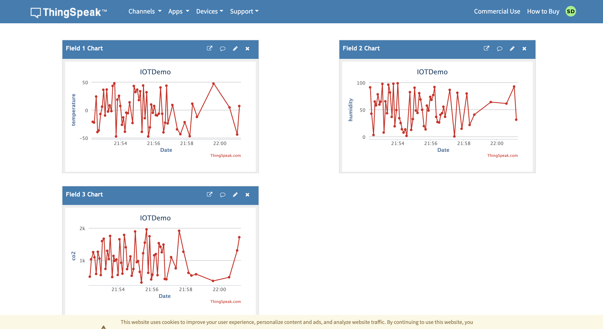

# IoT-Environmental-Monitoring-System
## Overview

A cloud-based IoT system for monitoring environmental parameters like temperature, humidity, and CO2 levels, using MQTT and ThingSpeak.

## Quick Start

1. **Clone this repository**
2. **Install dependencies :**
   
   ```bash
    pip install paho-mqtt```
4. **Configure MQTT & ThingSpeak** in `config.py`.
5. **Run the simulator**


## Screenshots

- **Dashboard View**


## Contributing

Feel free to fork, modify, and submit pull requests. For major changes, please open an issue first.

